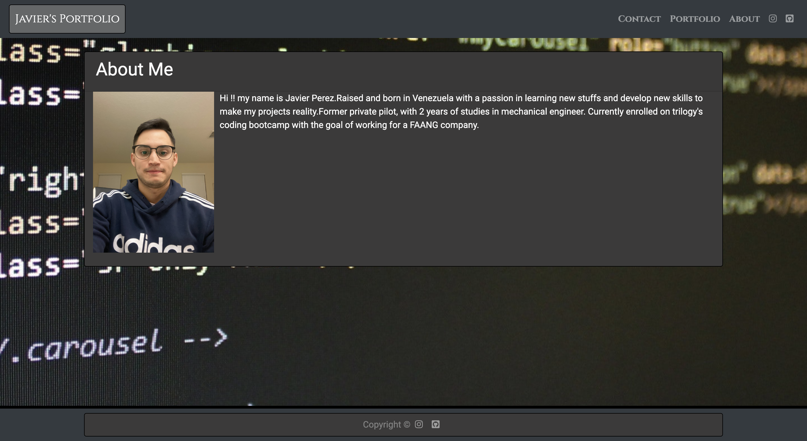
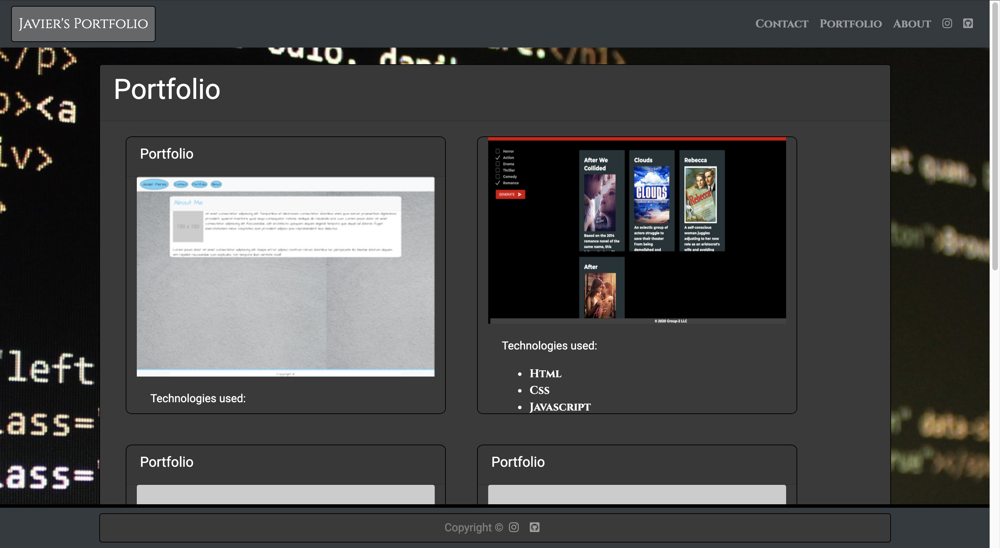
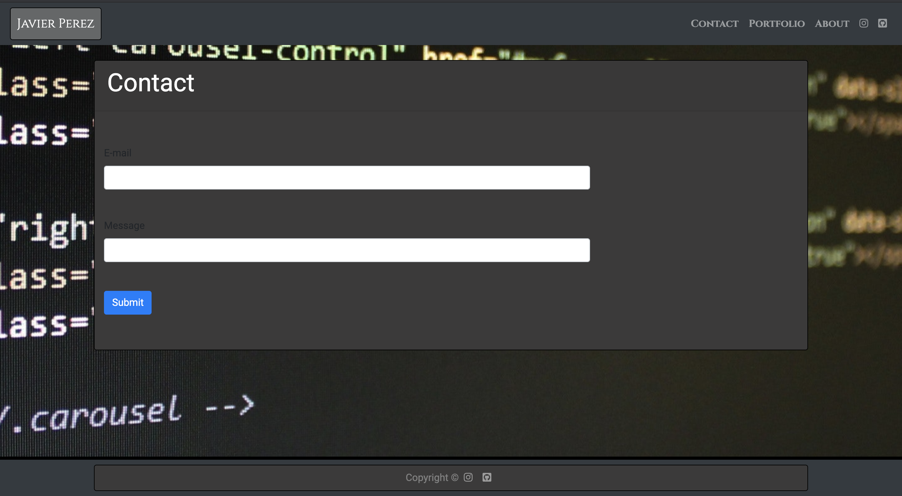

# My Portfolio

## My Respository
this is the repo where all the magic is happening for Coding Quiz (https://github.com/japb1998/portfolio). 

## Files
contains an index.html file with the bio, a portfolio.html with my current proyects and the technologies used for it and a contact.html file with the inputs to be contacted.

## index.html

## portfolio.html

 ## contact.html
 
 